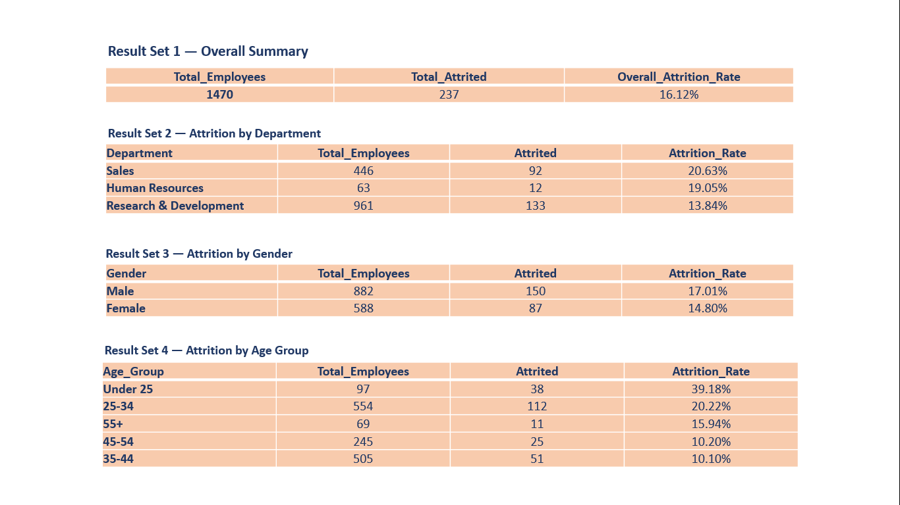
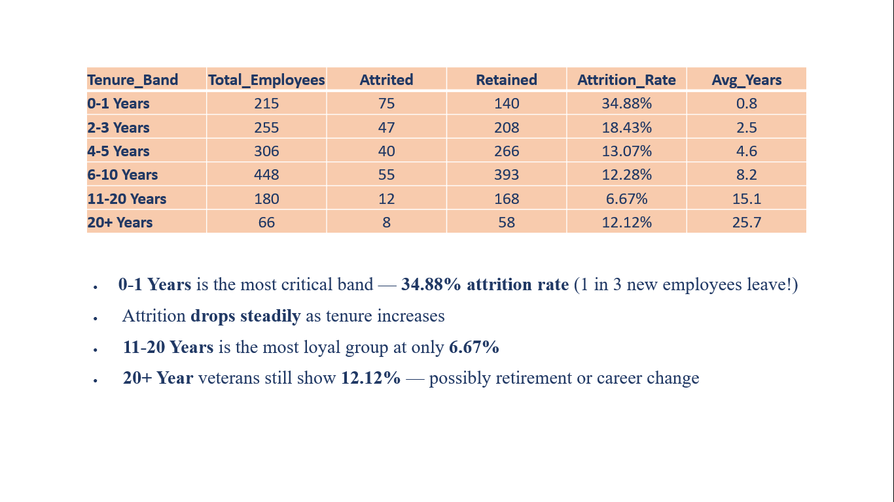

# 👥 HR Analytics — Employee Attrition & Performance Analysis


---

## 📌 Project Overview

This project presents a comprehensive **HR Analytics study on Employee Attrition & Performance** using **MySQL**.  
The analysis uncovers key factors driving employee attrition, evaluates workforce performance, and delivers actionable insights to help organizations improve employee retention and productivity.

---

## 🎯 Objective

To analyze HR data and answer critical business questions such as:
- Why are employees leaving the organization?
- Which departments have the highest attrition rates?
- How do salary, age, and experience impact attrition?
- What is the performance distribution across departments?
- Are there gender-based trends in attrition or performance?

---

## 📊 Analysis Coverage

| Area | Details |
|------|---------|
| 📉 Attrition Rate Analysis | Overall and department-wise attrition rates |
| 🏢 Department wise Analysis | Headcount, attrition and performance by department |
| 💰 Salary & Compensation | Impact of salary on attrition and performance |
| 👶 Age & Experience Trends | How age and years of experience affect attrition |
| 👫 Gender wise Analysis | Gender-based attrition and performance patterns |

---

## 🛠️ MySQL Features & Concepts Used

- ✅ **SELECT & WHERE Queries** — Filtered and extracted specific employee records
- ✅ **GROUP BY & HAVING** — Grouped data by department, gender, age band and more
- ✅ **Aggregate Functions** — COUNT, AVG, SUM, MAX, MIN for summarizing HR metrics
- ✅ **Subqueries** — Nested queries for complex filtering and comparisons
- ✅ **CTEs (Common Table Expressions)** — Simplified complex multi-step queries
- ✅ **Window Functions** — RANK(), ROW_NUMBER(), PARTITION BY for advanced analysis
- ✅ **Views** — Created reusable virtual tables for key HR metrics
- ✅ **Stored Procedures** — Automated repetitive analysis tasks efficiently

---

## 📁 Files in This Repository

```
hr-analytics-employee-attrition/
│
├── 📊 HR_Analytics_Presentation.pptx    # Project presentation slides
├── 📄 HR_Analytics_Report.docx          # Detailed project report                    
├── slide1.png                       # Presentation preview images
├── slide2.png
└── 📄 README.md                          # Project documentation
```

---

## 📸 Project Preview

> 
> 

---

## 📂 Data Source

- **Source:** [Kaggle](https://www.kaggle.com) — Publicly available HR Analytics Dataset
- **Data includes:** Employee ID, Age, Gender, Department, Job Role, Salary, Performance Rating, Years of Experience, Attrition Status

---

## 💡 Key Insights from the Analysis

- 📉 Overall attrition rate is significantly higher in **Sales and HR departments**
- 💰 Employees with **lower salary bands** show a much higher tendency to leave
- 👶 **younger employees (age 25–35)** with less than 3 years of experience have the highest attrition
- 👫 **Gender-based analysis** reveals differences in performance ratings and attrition patterns
- 🏆 High performers are more likely to stay when **compensation is competitive**
- 📊 Department wise performance tracking reveals **training and development gaps**

---

## 🧠 Skills Demonstrated

- Data Analysis using MySQL
- Writing Complex SQL Queries
- HR Domain Knowledge
- Business Insight Generation
- Data Storytelling via PowerPoint
- Report Writing & Documentation

---

## 📊 Sample SQL Queries

### Overall Attrition Rate
```sql
SELECT 
    COUNT(*) AS Total_Employees,
    SUM(CASE WHEN Attrition = 'Yes' THEN 1 ELSE 0 END) AS Attrited_Employees,
    ROUND(SUM(CASE WHEN Attrition = 'Yes' THEN 1 ELSE 0 END) * 100.0 / COUNT(*), 2) AS Attrition_Rate
FROM hr_data;
```

### Department Wise Attrition
```sql
SELECT 
    Department,
    COUNT(*) AS Total_Employees,
    SUM(CASE WHEN Attrition = 'Yes' THEN 1 ELSE 0 END) AS Attrited,
    ROUND(SUM(CASE WHEN Attrition = 'Yes' THEN 1 ELSE 0 END) * 100.0 / COUNT(*), 2) AS Attrition_Rate
FROM hr_data
GROUP BY Department
ORDER BY Attrition_Rate DESC;
```

### Salary Impact on Attrition using CTE
```sql
WITH Salary_Bands AS (
    SELECT *,
        CASE 
            WHEN MonthlyIncome < 3000 THEN 'Low'
            WHEN MonthlyIncome BETWEEN 3000 AND 7000 THEN 'Medium'
            ELSE 'High'
        END AS Salary_Band
    FROM hr_data
)
SELECT 
    Salary_Band,
    COUNT(*) AS Total,
    SUM(CASE WHEN Attrition = 'Yes' THEN 1 ELSE 0 END) AS Attrited,
    ROUND(SUM(CASE WHEN Attrition = 'Yes' THEN 1 ELSE 0 END) * 100.0 / COUNT(*), 2) AS Attrition_Rate
FROM Salary_Bands
GROUP BY Salary_Band
ORDER BY Attrition_Rate DESC;
```

---

## 👩‍💻 About Me

I am a **Post Graduate** with professional work experience, currently upskilling in **Data Analytics**.  
This project is part of my portfolio as I transition into a Data Analyst role.

🔗 **LinkedIn:** [linkedin.com/in/poorani-kumar-945ab03b3](https://www.linkedin.com/in/poorani-kumar-945ab03b3/)  
📧 **Email:** poorani.in@gmail.com

---

## 🤝 Let's Connect!

If you're a recruiter or fellow data enthusiast, feel free to reach out.  
I am actively looking for **Data Analyst opportunities**!

---

*⭐ If you found this project helpful, consider giving it a star!*
